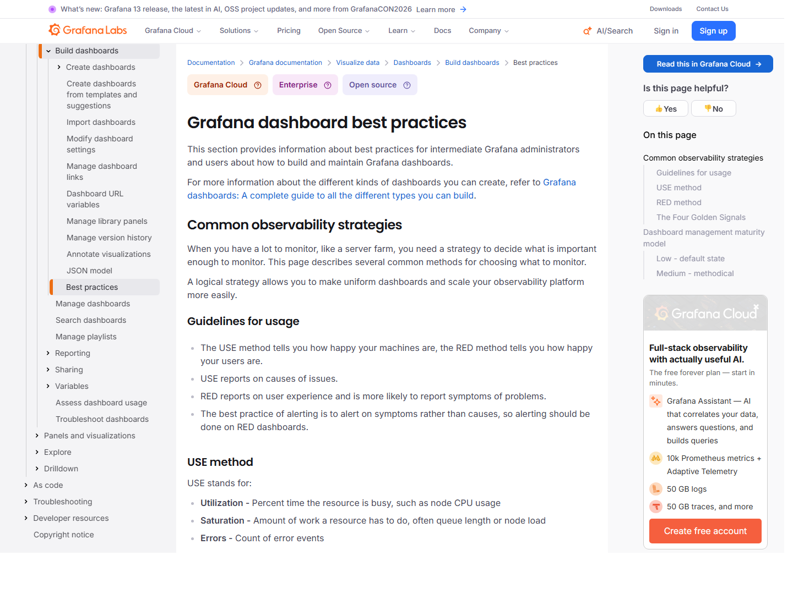
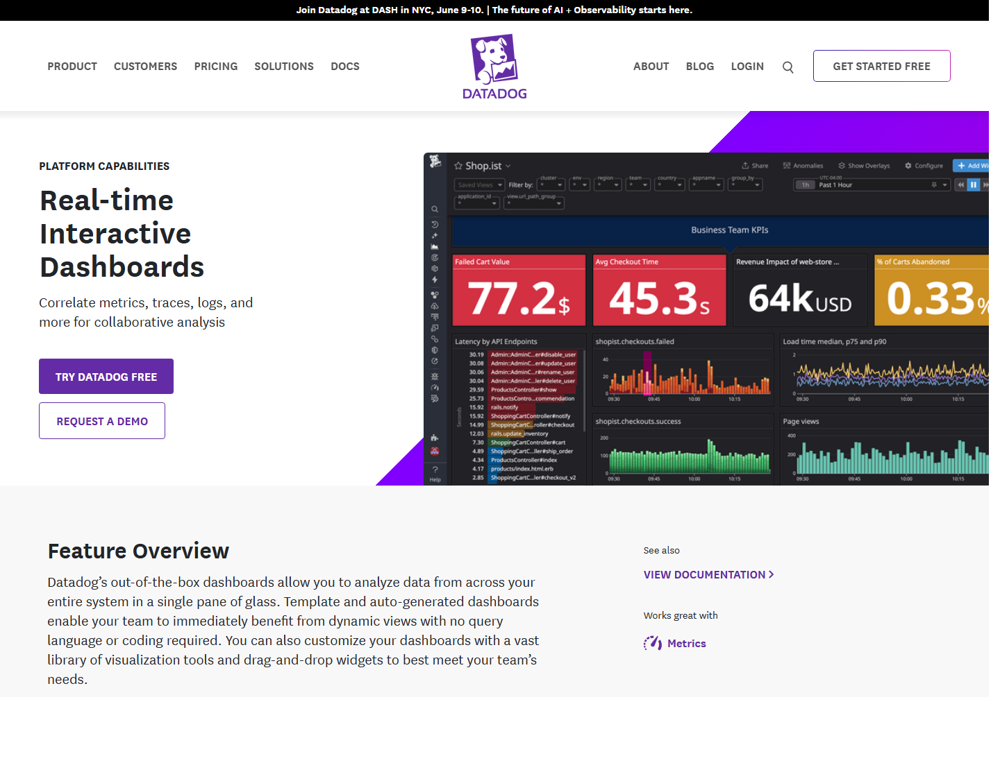
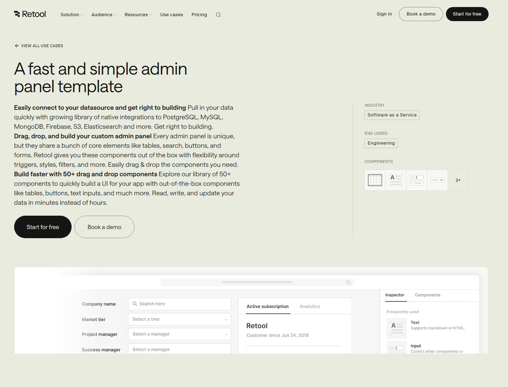
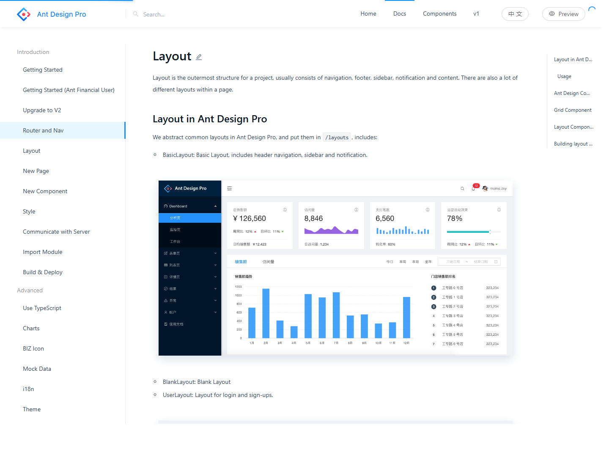

# Design Research: KAster_CTI 관리자 웹 디자인 시안

## TL;DR
KAster_CTI 관리자 웹은 일반 SaaS 관리자 페이지보다 "실시간 운영 감시 + 통화 제어 + 설정 관리" 비중이 높습니다. 기본 추천은 **시안 A: 운영상황실형 콘솔**입니다. 현재 코드의 다크 톤, KPI 스트립, 콜 칸반, 경보 패널 구조를 유지하면서 정보 밀도와 상태 신호만 더 정리하면 가장 적은 변경으로 운영 효율을 올릴 수 있습니다.

Lazyweb MCP 도구가 현재 세션에 노출되지 않아 Lazyweb 데이터베이스 검색은 실행하지 못했습니다. 대신 공개 웹 레퍼런스 캡처와 현재 `apps/admin` 구조 분석을 기반으로 정리했습니다.

## Recommendations / Next Steps

1. **기본안은 시안 A로 선택** — 실시간 콜센터 운영 화면은 Grafana/Datadog 계열처럼 상태, 경보, 추세, 현재 이벤트가 한 화면에서 보여야 합니다. 현재 `dashboard-compact` 구조와 가장 잘 맞습니다.
2. **고객/차단/녹취/리포트 화면은 시안 B 패턴을 부분 적용** — Retool류 내부툴처럼 테이블, 필터, 상세 drawer, 일괄 액션이 반복되는 화면에 적합합니다.
3. **멀티 지점/권한/설정 운영이 커지면 시안 C를 단계적으로 적용** — Ant Design Pro식 정보구조를 쓰되, 마케팅성 카드/설명 영역은 줄이고 지점/역할/상태 맥락을 상단 작업줄에 고정합니다.

## 시안 A: 운영상황실형 콘솔

**용도:** `/dashboard`, `/live-calls`, `/monitoring`, 장애/백로그/콜 흐름 관제  
**톤:** 다크 기본, hairline 구분선, 신호색은 초록/파랑/노랑/빨강만 제한적으로 사용  
**핵심:** "지금 어디가 막혔는지"가 5초 안에 보여야 합니다.

```
┌────────────────────────────────────────────────────────────────────┐
│ CTI Admin  지점: 전체  갱신 23:32:10  API OK  AMI OK  Redis OK      │
├───────────────┬────────────────────────────────────────────────────┤
│ 운영 메뉴      │ KPI strip: 대기 | 응답률 | 평균대기 | 포기 | 상담중    │
│               ├────────────────────────────────────────────────────┤
│ Dashboard     │ 경보 3건     │ 실시간 콜 칸반: 대기/벨/통화/후처리/종료 │
│ Live Calls    │              │                                    │
│ Monitoring    ├──────────────┴────────────────────────────────────┤
│ Reports       │ 큐 요약 테이블 │ 상담원 상태 │ 시간대 트래픽           │
└───────────────┴────────────────────────────────────────────────────┘
```

**적용 포인트**
- 상단 카드형 헤더를 줄이고, 지점 필터/갱신시간/인프라 상태를 한 줄 운영 바에 고정합니다.
- KPI는 카드 5개보다 구분선으로 나뉜 strip이 적합합니다. 현재 구현 방향과 일치합니다.
- 콜 칸반은 컬럼 수와 높이를 안정적으로 고정하고, 카드 내부 텍스트는 ANI, DID, 큐, 경과시간만 남깁니다.
- 경보 패널은 우측 고정 폭으로 두되, 색보다 심각도/발생시각/대상 큐가 먼저 읽히게 합니다.

**장점**
- 현재 관리자 앱 구조와 가장 잘 맞아 구현 비용이 낮습니다.
- 실시간 운영자가 화면을 계속 켜두는 용도에 적합합니다.
- 다크 모드가 업무적 이유를 가집니다. 장시간 모니터링, 상태색 가독성, 야간 운영에 맞습니다.

**주의점**
- 설정 화면까지 전부 이 스타일로 밀어붙이면 폼/테이블 가독성이 떨어질 수 있습니다.
- 모든 텍스트를 굵게 처리하는 현재 CSS는 밀도 높은 표에서 피로도가 큽니다. 숫자/상태/헤더 중심으로만 강세를 제한하는 편이 좋습니다.

## 시안 B: 데이터 워크벤치형 관리자

**용도:** `/customers`, `/blocklist`, `/reports/*`, `/settings/agents`, `/settings/queues`, `/reports/recordings`  
**톤:** 라이트 또는 중립 다크 모두 가능, 테이블 중심, 필터와 bulk action 우선  
**핵심:** "검색, 비교, 편집, 내보내기"가 한 흐름 안에서 끝나야 합니다.

```
┌────────────────────────────────────────────────────────────────────┐
│ 고객 관리                         [지점] [상태] [검색어] [가져오기] │
├───────────────┬────────────────────────────────────────────────────┤
│ 업무 메뉴      │ Saved filters | 빠른 필터 칩 | 선택 12건: [차단] [SMS] │
│               ├────────────────────────────────────────────────────┤
│ Customers     │ 고객명 │ 대표번호 │ 지점 │ 최근통화 │ 수신거부 │ 메모 │
│ Blocklist     │ ...    │ ...      │ ...  │ ...      │ ...      │ ...  │
│ Recordings    ├────────────────────────────────────────────────────┤
│ Reports       │ 우측 drawer: 고객 상세, 통화 이력, 메모, 인라인 편집    │
└───────────────┴────────────────────────────────────────────────────┘
```

**적용 포인트**
- 화면 상단에는 설명문 대신 필터, 검색, 가져오기/내보내기, 선택 항목 액션을 둡니다.
- 상세는 새 화면보다 현재처럼 drawer를 유지합니다. 고객/녹취/차단 항목은 목록에서 빠르게 열고 닫는 흐름이 맞습니다.
- 테이블 컬럼은 운영 판단에 필요한 필드만 기본 노출하고, 나머지는 컬럼 설정 또는 상세 drawer로 보냅니다.
- 빈 상태/도움말 문구는 짧게 유지하고, 실제 액션 버튼을 우선 배치합니다.

**장점**
- 관리자 사용자가 가장 자주 하는 정비 작업에 강합니다.
- 고객관리, 차단목록, 녹취, 리포트, 권한 설정 등 반복 CRUD 화면 품질이 올라갑니다.
- 현재 Ant Design 테이블/Drawer 구성과 충돌이 작습니다.

**주의점**
- 실시간 대시보드까지 워크벤치형으로 바꾸면 운영 긴급도가 약해집니다.
- 필터가 많아질수록 상단이 복잡해지므로, 1차 필터와 고급 필터를 분리해야 합니다.

## 시안 C: 지점 운영 포털형

**용도:** `/settings/branches`, `/settings/permissions`, `/asterisk`, `/numbers`, `/system`, `/integrations`  
**톤:** 중립 배경, 섹션형 정보구조, 단계/검증 상태 중심  
**핵심:** "어느 지점의 어떤 설정이 운영 반영 가능한 상태인지"가 보여야 합니다.

```
┌────────────────────────────────────────────────────────────────────┐
│ 설정 관리  지점: 강남  배포상태: 검증필요  [미리보기] [검증] [적용] │
├───────────────┬────────────────────────────────────────────────────┤
│ 설정 메뉴      │ Branch summary: DID 12 | 큐 4 | 상담원 38 | 프롬프트 9 │
│               ├───────────────────────┬────────────────────────────┤
│ Branches      │ 설정 섹션 목록         │ 선택 섹션 편집 폼            │
│ Prompts       │ DID / IVR / Trunk      │ 변경 전후 diff / preview      │
│ Permissions   │ Queue / Forwarding     │ 검증 결과 / 운영 반영 로그     │
└───────────────┴───────────────────────┴────────────────────────────┘
```

**적용 포인트**
- 설정 화면은 카드 나열보다 좌측 섹션 목록 + 우측 편집/미리보기 구조가 좋습니다.
- PBX/IVR/Trunk 같은 위험 설정에는 "변경 전후 diff", "검증", "적용" 버튼을 같은 작업줄에 둡니다.
- 지점 컨텍스트를 상단에 고정하고, 화면마다 지점 선택 위치가 바뀌지 않게 합니다.
- 성공/실패 결과는 모달보다 페이지 안의 검증 패널에 남깁니다.

**장점**
- 지점별 운영, 권한, PBX 설정이 늘어날 때 구조가 무너지지 않습니다.
- 설정 변경의 위험도를 UI가 자연스럽게 드러냅니다.
- 운영 배포 전 확인 흐름을 만들기 좋습니다.

**주의점**
- 현재 단순 CRUD 화면에는 과한 구조일 수 있습니다.
- 전체 앱을 한 번에 C로 바꾸기보다 설정 도메인부터 부분 적용해야 합니다.

## Key Examples


*Grafana — 운영 대시보드는 목적별 패널 그룹, 일관된 시간 범위, 과도한 패널 수 억제가 중요하다는 방향을 제시합니다. [Web]*


*Datadog — 위젯 기반 대시보드와 모니터링/경보 맥락을 한 화면에 묶는 방식이 시안 A의 근거입니다. [Web]*


*Retool — 내부 관리자 도구는 테이블, 필터, 편집 액션, 상세 패널이 핵심이라는 점에서 시안 B와 맞습니다. [Web]*


*Ant Design Pro — 엔터프라이즈 관리자 앱의 좌측 내비게이션, 상단 작업줄, 라우트 기반 정보구조는 시안 C의 참고점입니다. [Web]*

## Patterns

- **운영 화면과 설정 화면을 같은 레이아웃 원칙으로 묶되, 정보 밀도는 다르게 둡니다.** 대시보드는 한 화면 관제, 설정/리포트는 테이블 워크벤치가 적합합니다.
- **상단 영역은 설명보다 현재 컨텍스트가 우선입니다.** 지점, 갱신 시각, 인프라 상태, 권한 역할, 적용 상태가 가장 가치 있습니다.
- **상태색은 의미를 고정해야 합니다.** 초록=정상/가용, 파랑=진행/통화, 노랑=주의/대기, 빨강=장애/실패로 제한합니다.
- **Drawer는 유지하는 편이 좋습니다.** 콜/고객/녹취/설정 항목을 새 화면으로 보내면 운영 흐름이 끊깁니다.
- **테이블은 더 조밀해도 됩니다.** 다만 행 높이, 숫자 정렬, 컬럼 고정, 줄임표, 필터 위치를 안정화해야 합니다.

## Anti-Patterns

- 대시보드 첫 화면에 큰 환영 문구, 설명 카드, 장식 이미지를 두는 방식은 KAster_CTI에 맞지 않습니다.
- 모든 화면을 카드 그리드로 만들면 콜센터 운영에서 필요한 비교/스캔 속도가 떨어집니다.
- 다크 배경에서 모든 텍스트를 굵게 처리하면 표와 폼의 정보 위계가 무너집니다.
- 설정 변경을 모달 여러 단계로 쪼개면 PBX/IVR 변경 전후를 비교하기 어렵습니다.
- 경보를 색상만으로 표현하면 장시간 운영 중 우선순위 판단이 느려집니다. 심각도, 대상, 시간, 조치 버튼이 함께 필요합니다.

## 선택 가이드

| 선택지 | 추천 여부 | 가장 맞는 화면 | 구현 난이도 | 판단 |
| --- | --- | --- | --- | --- |
| 시안 A 운영상황실형 | 1순위 | Dashboard, Live Calls, Monitoring | 낮음-중간 | 현재 구조를 살리면서 가장 큰 개선 효과 |
| 시안 B 데이터 워크벤치형 | 병행 적용 | Customers, Blocklist, Reports, Recordings | 중간 | CRUD/조회 화면 품질 개선에 필수 |
| 시안 C 지점 운영 포털형 | 단계 적용 | Branches, Permissions, Asterisk, System | 중간-높음 | 설정 규모가 커질수록 필요 |

## 최종 추천 조합

**A를 전체 시각 언어의 기준으로 삼고, B와 C를 화면 성격별 패턴으로 섞는 하이브리드가 가장 적합합니다.**

- `/dashboard`, `/live-calls`, `/monitoring`: 시안 A
- `/customers`, `/blocklist`, `/reports/*`, `/agents`, `/queues`: 시안 B
- `/settings/branches`, `/settings/permissions`, `/asterisk`, `/numbers`, `/system`: 시안 C

이 방식이면 현재 앱의 다크 운영 콘솔 정체성을 유지하면서도, 설정/관리 화면이 관제 대시보드처럼 과하게 답답해지는 문제를 피할 수 있습니다.

## Sources

- Grafana Labs, Dashboard best practices: https://grafana.com/docs/grafana/latest/dashboards/build-dashboards/best-practices/
- Datadog, Dashboarding: https://www.datadoghq.com/dashboarding/
- Retool, Admin panel template: https://retool.com/use-case/admin-panel-template
- Ant Design Pro, Layout documentation: https://v2-pro.ant.design/docs/layout/
