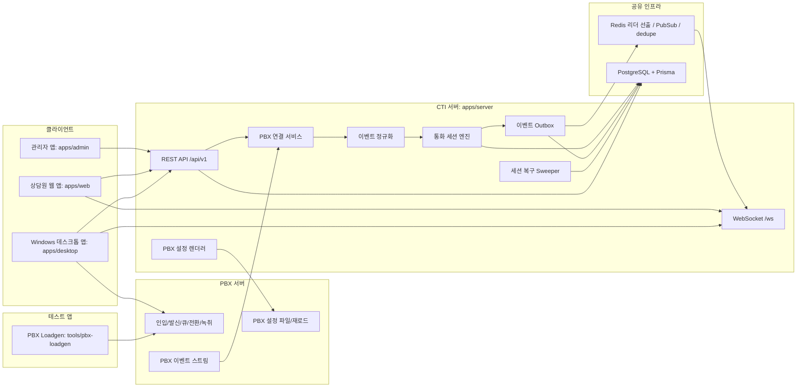
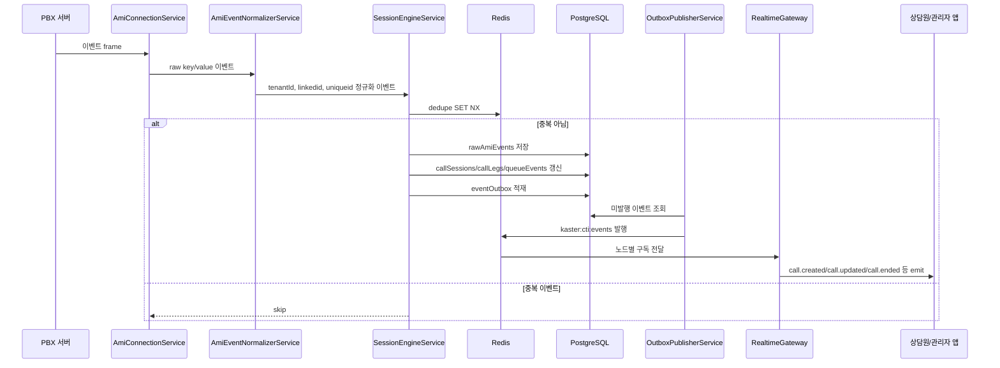
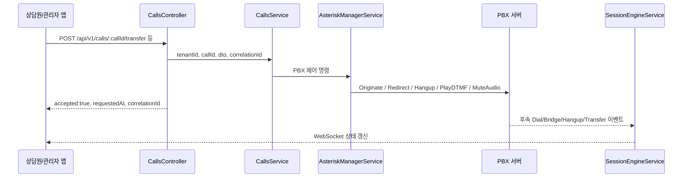

# KAster CTI 시스템 설계서

작성일: 2026-05-06

## 1. 문서 범위

이 문서는 KAster CTI의 현재 저장소 기준 설계를 정리한다. 범위는 전체 시스템 구조도, 앱 단위별 API 명세, 데이터베이스 설계도, 단위별 기능 명세다.

표현 기준은 다음과 같다.

- 사용자에게 노출되는 용어는 PBX로 통일한다.
- 내부 코드 식별자, API 경로, DB 모델명처럼 이미 계약된 구현명은 그대로 표기한다.
- 실제 구현 기준은 `apps/server`, `apps/web`, `apps/admin`, `apps/desktop`, `tools/pbx-loadgen`, `apps/server/prisma/schema.prisma`다.

## 2. 전체 시스템 구조도

KAster CTI는 PBX 서버, CTI 서버, Redis, PostgreSQL, 상담원 웹 앱, 관리자 앱, Windows 데스크톱 앱, PBX 부하 테스트 앱으로 구성된다.

## 3. 핵심 런타임 흐름

### 3.1 통화 이벤트 처리

### 3.2 통화 제어 처리

REST 제어 API는 요청 접수를 `accepted:true`로 반환한다. 최종 성공/실패 판정은 후속 PBX 이벤트를 세션 엔진이 처리한 결과를 기준으로 한다.

## 4. 앱 단위별 API 명세

공통 규칙은 다음과 같다.

- REST prefix: `/api/v1`
- 일반 JSON 응답 envelope: `{ success, data, error }`
- 통화 제어 명령 응답: `{ accepted, requestedAt, correlationId, idempotencyKey? }`
- 인증: JWT Bearer 토큰. 관리자 기능은 `supervisor` 또는 `admin` 역할과 메뉴 권한을 함께 확인한다.
- WebSocket namespace: `/ws`, access token 기반 handshake.

### 4.1 CTI 서버 REST API

#### 인증/세션

| Method | Path | 용도 | 주요 사용자 |
| --- | --- | --- | --- |
| POST | `/auth/login` | 로그인, access/refresh token 발급 | 웹/관리자/데스크톱 |
| POST | `/auth/refresh` | refresh token 회전 후 새 access 발급 | 웹/관리자/데스크톱 |
| POST | `/auth/logout` | 현재 refresh token revoke | 웹/관리자/데스크톱 |
| POST | `/auth/logout-all` | 현재 상담원의 모든 세션 종료 | 웹/관리자/데스크톱 |
| GET | `/me/session` | 현재 상담원 세션과 제어 capability 조회 | 상담원 웹 |
| GET | `/auth/desktop/session` | 데스크톱 전용 세션/소프트폰 설정 조회 | 데스크톱 |
| POST | `/auth/handoff` | 웹에서 데스크톱 연결용 handoff token 생성 | 상담원 웹 |
| POST | `/auth/handoff/exchange` | 데스크톱에서 handoff token 교환 | 데스크톱 |
| POST | `/auth/web-handoff` | 데스크톱에서 웹 연결용 handoff 생성 | 데스크톱 |
| POST | `/auth/web-handoff/exchange` | 웹에서 handoff token 교환 | 상담원 웹 |

#### 통화

| Method | Path | 용도 | 비고 |
| --- | --- | --- | --- |
| GET | `/calls/active` | 활성 통화 목록 | `branchId`, `limit` 지원 |
| GET | `/calls/history` | 통화내역 조회 | 기간, 상담원, 지사, 상태 필터 |
| GET | `/calls/:callId` | 통화 상세 | leg, memo, transfer, recording, queueEvents 포함 |
| POST | `/calls/originate` | 외부 발신 Click-to-Call | 후속 PBX 이벤트로 결과 판정 |
| POST | `/calls/originate/internal` | 상담원 간 내선 발신 | 현재 로그인 상담원 기준 |
| POST | `/calls/:callId/transfer` | blind/attended 전환 요청 | 상담원 leg 기준 PBX Redirect |
| POST | `/calls/:callId/transfer/attended/cancel` | 상담 전환 취소 | candidate를 실패/취소 상태로 닫음 |
| POST | `/calls/:callId/transfer/attended/complete` | 상담 전환 완료 | feature code 기반 완료 요청 |
| POST | `/calls/:callId/pickup` | 대기 콜 당겨받기 | 로그인 상담원 내선으로 연결 |
| POST | `/calls/:callId/mute` | 음소거/해제 | 요청 성공 기준 UI 갱신 |
| POST | `/calls/:callId/hold` | 보류 | feature code 필요 |
| POST | `/calls/:callId/resume` | 보류 해제 | feature code 필요 |
| POST | `/calls/:callId/memo` | 상담 메모/후처리 저장 | ACW 결과 저장 |
| POST | `/calls/:callId/hangup` | 통화 종료 요청 | 후속 Hangup 이벤트로 세션 종료 |
| GET | `/calls/recordings/list` | 녹취 목록 | 관리자 보고서 |
| GET | `/calls/recordings/:recordingId/stream` | 녹취 스트리밍 | Range 요청 지원 |
| GET | `/calls/recordings/:recordingId/download` | 녹취 다운로드 | 다운로드 감사 로그 기록 |

#### 상담원/큐

| Method | Path | 용도 |
| --- | --- | --- |
| GET | `/agents` | 상담원 목록 |
| POST | `/agents` | 상담원 생성 |
| GET | `/agents/:agentId` | 상담원 상세 |
| PATCH | `/agents/:agentId` | 상담원 수정 |
| DELETE | `/agents/:agentId` | 상담원 비활성화 |
| POST | `/agents/:agentId/reset-password` | 비밀번호 재설정 |
| GET | `/agents/:agentId/history` | 상담원 상태 이력 |
| POST | `/agents/:agentId/status` | 상담원 상태 변경 |
| GET | `/queues/summary` | 큐 실시간 요약 |
| GET | `/queues` | 큐 목록 |
| POST | `/queues` | 큐 생성 |
| PATCH | `/queues/:queueId` | 큐 수정 |
| DELETE | `/queues/:queueId` | 큐 비활성화 |
| GET | `/queues/:queueId/members` | 큐 멤버 조회 |
| PUT | `/queues/:queueId/members` | 큐 멤버 재설정 |

#### 고객/공지/문자 템플릿

| Method | Path | 용도 |
| --- | --- | --- |
| GET | `/customers` | 고객 목록 |
| GET | `/customers/search` | 전화번호/고객명 검색 |
| POST | `/customers` | 고객 생성 |
| POST | `/customers/import` | 고객 대량 가져오기 |
| GET | `/customers/:customerId` | 고객 상세 |
| GET | `/customers/:customerId/history` | 고객 통화 이력 |
| PUT | `/customers/:customerId` | 고객 수정 |
| DELETE | `/customers/:customerId` | 고객 삭제 |
| GET | `/announcements` | 상담원 공지 목록 |
| GET | `/sms-templates` | 문자 템플릿 목록 |
| POST | `/sms-templates` | 문자 템플릿 생성 |
| PUT | `/sms-templates/:templateId` | 문자 템플릿 수정 |
| DELETE | `/sms-templates/:templateId` | 문자 템플릿 삭제 |

#### 관리자 운영 API

| Method | Path | 용도 |
| --- | --- | --- |
| GET | `/admin/dashboard` | 관리자 대시보드 집계 |
| GET | `/admin/reports/ami-logs` | PBX 이벤트 로그 조회 |
| GET | `/admin/reports/ivr-failures` | IVR 실패 리포트 |
| GET | `/admin/reports/recording-download-audits` | 녹취 다운로드 감사 로그 |
| GET | `/admin/monitoring/operations` | 운영 모니터링 요약 |
| GET | `/admin/announcements` | 관리자 공지 목록 |
| POST | `/admin/announcements` | 공지 생성 |
| POST | `/admin/announcements/:announcementId` | 공지 수정 |
| DELETE | `/admin/announcements/:announcementId` | 공지 삭제 |
| GET | `/admin/settings/branches` | 지사 목록 |
| POST | `/admin/settings/branches` | 지사 생성 |
| POST | `/admin/settings/branches/:branchId` | 지사 수정 |
| DELETE | `/admin/settings/branches/:branchId` | 지사 삭제 |
| GET | `/admin/settings/branches/:branchId/mappings` | 지사-상담원/큐/DID 매핑 조회 |
| POST | `/admin/settings/branches/:branchId/mappings` | 지사 매핑 저장 |
| GET | `/admin/settings/permissions/current` | 현재 사용자 권한 프로필 |
| GET | `/admin/settings/permissions` | 역할 권한 목록 |
| POST | `/admin/settings/permissions` | 역할 권한 저장 |
| GET | `/admin/settings/permissions/accounts/:agentId` | 개별 계정 권한 조회 |
| POST | `/admin/settings/permissions/accounts/:agentId` | 개별 계정 권한 저장 |
| GET | `/admin/settings/system` | 시스템 설정 조회 |
| POST | `/admin/settings/system` | 시스템 설정 저장 |

#### PBX 설정 API

내부 구현 경로명은 `/asterisk-config`를 유지한다. 운영 화면과 문서 설명에서는 PBX 설정으로 표기한다.

| Method | Path | 용도 |
| --- | --- | --- |
| GET | `/asterisk-config/trunks` | 트렁크 목록 |
| POST | `/asterisk-config/trunks` | 트렁크 생성 |
| POST | `/asterisk-config/trunks/bulk` | 트렁크 대량 생성 |
| PUT | `/asterisk-config/trunks/:id` | 트렁크 수정 |
| DELETE | `/asterisk-config/trunks/:id` | 트렁크 삭제 |
| GET | `/asterisk-config/dids` | DID 목록 |
| POST | `/asterisk-config/dids` | DID 생성 |
| PUT | `/asterisk-config/dids/:id` | DID 수정 |
| DELETE | `/asterisk-config/dids/:id` | DID 삭제 |
| GET | `/asterisk-config/ivr-menus` | IVR 메뉴 목록 |
| POST | `/asterisk-config/ivr-menus` | IVR 메뉴 생성 |
| PUT | `/asterisk-config/ivr-menus/:id` | IVR 메뉴 수정 |
| DELETE | `/asterisk-config/ivr-menus/:id` | IVR 메뉴 삭제 |
| GET | `/asterisk-config/agents-sip` | 상담원 SIP 설정 조회 |
| PUT | `/asterisk-config/agents-sip/:agentId/password` | 상담원 SIP 비밀번호 변경 |
| POST | `/asterisk-config/agents-sip/sync` | 상담원 SIP 설정 동기화 |
| GET | `/asterisk-config/forwarding-rules` | 착신전환 규칙 목록 |
| POST | `/asterisk-config/forwarding-rules` | 착신전환 규칙 생성 |
| PUT | `/asterisk-config/forwarding-rules/:id` | 착신전환 규칙 수정 |
| DELETE | `/asterisk-config/forwarding-rules/:id` | 착신전환 규칙 삭제 |
| GET | `/asterisk-config/prompts` | 멘트 목록 |
| POST | `/asterisk-config/prompts` | 멘트 메타데이터 생성 |
| POST | `/asterisk-config/prompts/upload` | 멘트 음성 업로드 |
| GET | `/asterisk-config/prompts/:id/stream` | 멘트 음성 스트리밍 |
| PUT | `/asterisk-config/prompts/:id` | 멘트 수정 |
| DELETE | `/asterisk-config/prompts/:id` | 멘트 삭제 |
| GET | `/asterisk-config/blocklist` | 블랙리스트 목록 |
| POST | `/asterisk-config/blocklist` | 블랙리스트 등록 |
| POST | `/asterisk-config/blocklist/import` | 블랙리스트 대량 가져오기 |
| PUT | `/asterisk-config/blocklist/:id` | 블랙리스트 수정 |
| DELETE | `/asterisk-config/blocklist/:id` | 블랙리스트 삭제 |
| GET | `/asterisk-config/preview` | PBX 설정 파일 미리보기 |
| POST | `/asterisk-config/reload` | PBX 설정 재로드 요청 |

#### 내부 IVR/ARS API

| Method | Path | 용도 |
| --- | --- | --- |
| POST | `/asterisk-config/internal/opt-out/register` | 수신거부 등록 |
| POST | `/asterisk-config/internal/opt-out/unregister` | 수신거부 해제 |
| POST | `/asterisk-config/internal/opt-out/smart/register` | 스마트 수신거부 등록 |
| POST | `/asterisk-config/internal/opt-out/smart/unregister` | 스마트 수신거부 해제 |
| POST | `/asterisk-config/internal/smart-ars/sms` | 스마트 ARS 문자 발송 액션 |
| POST | `/asterisk-config/internal/smart-ars/opt-out` | 스마트 ARS 수신거부 액션 |

#### 데스크톱 업데이트 API

| Method | Path | 용도 |
| --- | --- | --- |
| POST | `/agent-updates/session` | CTI access token을 updateSessionToken으로 교환 |
| GET | `/agent-updates/manifest` | 승인된 데스크톱 최신 manifest 조회 |
| POST | `/agent-updates/download-init` | 1회성 다운로드 token 발급 |
| GET | `/agent-updates/artifacts/:artifactId` | 설치 파일 다운로드 |
| POST | `/agent-updates/report` | 다운로드/설치/롤백 결과 보고 |

#### 상태/모니터링

| Method | Path | 용도 |
| --- | --- | --- |
| GET | `/health` | DB/Redis/PBX/콜/상담원/큐 상태 요약 |
| GET | `/health/ready` | readiness probe |
| GET | `/health/live` | liveness probe |
| GET | `/metrics` | Prometheus 형태 metric |

### 4.2 WebSocket 이벤트

| Event | Payload 기준 | 용도 |
| --- | --- | --- |
| `call.created` | `ActiveCall` | 신규 통화 세션 생성 |
| `call.updated` | `ActiveCall` | 통화 상태/고객/전환 상태 갱신 |
| `call.ended` | `{ callId, endedAt, talkSeconds }` | 통화 종료 |
| `screenpop.customer` | `{ callId, customer }` | 고객 팝업 |
| `agent.status.changed` | `{ agentId, statusCode }` | 상담원 상태 변경 |
| `queue.summary.updated` | `QueueSummary[]` | 큐 요약 갱신 |

### 4.3 상담원 웹 앱 API 사용 명세

`apps/web`는 real/mock 이중 모드로 동작한다. 실 모드에서 사용하는 주요 API는 다음과 같다.

| 화면/기능 | 주요 API | 비고 |
| --- | --- | --- |
| 로그인/로그아웃 | `/auth/login`, `/auth/logout`, `/auth/refresh` | access/refresh token localStorage 저장 |
| 세션 복구 | `/me/session`, `/agents/:agentId` | capability와 오늘 통계 보강 |
| 큐 요약 | `/queues/summary` | 대기/통화/가용 상담원 표시 |
| 활성 통화 | `/calls/active` | 현재 콜/고객 팝업/상태 표시 |
| 통화 이력 | `/calls/history` | 상담원 기준 최근 이력 |
| 상태 변경 | `/agents/:agentId/status` | AVAILABLE, BREAK 등 |
| 통화 제어 | `/calls/originate`, `/calls/originate/internal`, `/calls/:callId/transfer`, `/pickup`, `/mute`, `/hold`, `/resume`, `/hangup` | 명령 ack 후 WS 이벤트로 보정 |
| 후처리 | `/calls/:callId/memo` | ACW 메모/결과 저장 |
| 공지 | `/announcements` | 상담원 공지 표시 |
| 데스크톱 연결 | `/auth/handoff`, `/auth/web-handoff/exchange` | 웹-데스크톱 handoff |

### 4.4 관리자 앱 API 사용 명세

`apps/admin`은 `supervisor`/`admin` 역할과 메뉴 권한 기반으로 운영 기능을 제공한다.

| 메뉴 | 주요 API | 기능 |
| --- | --- | --- |
| 대시보드 | `/admin/dashboard` | KPI, 큐, 팀, 활성 콜, 알림 |
| 실시간 운영 | `/calls/active`, `/queues/summary`, `/agents`, `/admin/monitoring/operations` | 실시간 통화/큐/상담원/시스템 상태 |
| 보고서 | `/calls/history`, `/calls/recordings/list`, `/admin/reports/*` | CDR, 미연결 콜, 녹취, IVR 실패, 이벤트 로그 |
| 지사 관리 | `/admin/settings/branches`, `/admin/settings/branches/:branchId/mappings` | 지사, DID, 큐, 상담원 매핑 |
| 상담원 설정 | `/agents`, `/agents/:agentId`, `/agents/:agentId/reset-password` | 계정, 내선, SIP, 상태 |
| 호 분배룰 설정 | `/queues`, `/queues/:queueId/members` | 큐 전략과 멤버 |
| 착신전환 설정 | `/asterisk-config/forwarding-rules` | DID별 전환 정책 |
| 멘트 관리 | `/asterisk-config/prompts` | 멘트 메타데이터/업로드/재생 |
| 문자 템플릿 | `/sms-templates` | 일반/수신거부 문자 템플릿 |
| 권한 관리 | `/admin/settings/permissions*` | 역할/계정별 메뉴 권한 |
| PBX 설정 | `/asterisk-config/*`, `/asterisk-config/preview`, `/asterisk-config/reload` | 트렁크, DID, IVR, SIP, 설정 반영 |
| 고객 관리 | `/customers`, `/customers/import`, `/customers/:id/history` | 고객 목록, 상세, 가져오기, 이력 |
| 수신거부/블랙리스트 | `/asterisk-config/blocklist`, 내부 opt-out API | 차단/수신거부 운영 |
| 시스템 설정 | `/admin/settings/system` | 기본 통화/녹취/발신/SIP 설정 |

### 4.5 Windows 데스크톱 앱 IPC/API 명세

`apps/desktop`는 Electron main/preload/renderer 구조이며, renderer는 `window.desktopApi`를 통해 main process 기능을 호출한다.

| IPC API | 용도 |
| --- | --- |
| `getConfig`, `saveConfig` | 서버 URL, 채널, deviceId 저장 |
| `login`, `exchangeHandoff`, `connectWithProtocol` | 직접 로그인, handoff, `kaster-agent://` 프로토콜 연결 |
| `getSession`, `refreshSession`, `getDesktopSession` | 저장된 token 기반 세션 조회/갱신 |
| `connectRuntime` | CTI WebSocket 런타임 연결 |
| `changeAgentStatus` | 상담원 상태 변경 |
| `originate`, `originateInternal`, `transfer`, `cancelAttendedTransfer`, `completeAttendedTransfer`, `pickup`, `mute`, `hold`, `resume`, `hangup` | 데스크톱 통화 제어 |
| `getCallerIds`, `getAgentDirectory`, `getCallHistory` | 발신번호, 상담원 목록, 통화 이력 조회 |
| `getAudioPreferences`, `saveAudioPreferences` | 마이크/스피커/벨 장치 설정 |
| `checkForUpdates`, `prepareUpdate`, `applyPreparedUpdate` | 데스크톱 업데이트 확인/다운로드/적용 |
| `openCallHistoryPopup`, `openAgentListPopup` | 보조 창 실행 |
| `notifyIncomingCall`, `focusWindow`, `setWindowMode` | 알림, 포커스, 창 모드 |
| `onEvent`, `onProtocolConnect` | CTI 이벤트와 프로토콜 연결 이벤트 구독 |

### 4.6 PBX Loadgen CLI 명세

`tools/pbx-loadgen`는 PBX 인입/DTMF/부하 시나리오 검증 도구다.

| 명령 | 용도 |
| --- | --- |
| `validate` | YAML 시나리오 문법과 필수 필드 검증 |
| `dry-run` | 실제 통화 없이 실행 계획 확인 |
| `run` | PBX 대상 실제 인입/DTMF/동시성 테스트 |
| `report` | 실행 결과 리포트 생성 |

## 5. 데이터베이스 설계도

### 5.1 논리 ERD

```mermaid
erDiagram
  tenants ||--o{ agents : owns
  tenants ||--o{ queues : owns
  tenants ||--o{ customers : owns
  tenants ||--o{ callSessions : owns
  tenants ||--o{ branches : owns
  tenants ||--o{ rolePermissions : owns
  tenants ||--o{ tenantSystemSettings : owns
  tenants ||--o{ tenantSmsTemplate : owns

  agents ||--o{ agentStatusHistory : has
  agents ||--o{ callLegs : handles
  agents ||--o{ callMemos : writes
  agents ||--o{ refreshTokens : has
  agents ||--o{ agentMenuPermissions : has
  queues ||--o{ queueAgentMembers : has
  agents ||--o{ queueAgentMembers : joins

  customers ||--o{ customerPhones : has
  customers ||--o{ callSessions : related
  customers ||--o{ callMemos : related

  callSessions ||--o{ callLegs : contains
  callSessions ||--o{ queueEvents : has
  callSessions ||--o{ callRecordings : has
  callSessions ||--o{ callMemos : has
  callSessions ||--o{ callTransfers : has

  branches ||--o{ branchAgents : maps
  branches ||--o{ branchQueues : maps
  branches ||--o{ branchDids : maps
  agents ||--o{ branchAgents : mapped
  queues ||--o{ branchQueues : mapped

  AsteriskDid ||--o{ branchDids : mapped
  AsteriskDid ||--o| asteriskForwardingRules : has
  AsteriskIvrMenu ||--o{ AsteriskIvrEntry : has
  AsteriskIvrMenu ||--o{ AsteriskDid : routes

  tenants ||--o{ AsteriskTrunk : owns
  tenants ||--o{ AsteriskDid : owns
  tenants ||--o{ AsteriskIvrMenu : owns
  tenants ||--o{ AsteriskPrompt : owns
  tenants ||--o{ AsteriskBlocklistEntry : owns

  tenants ||--o{ rawAmiEvents : stores
  tenants ||--o{ eventOutbox : stores
  tenants ||--o{ attendedTransferCandidates : stores
  tenants ||--o{ agentDesktopReleases : owns
  tenants ||--o{ agentDesktopUpdateAuditLogs : stores
```

### 5.2 테이블 그룹

| 그룹 | 테이블 | 목적 |
| --- | --- | --- |
| 멀티테넌트 | `tenants` | tenant 루트, 대부분의 테이블 파티션 기준 |
| 상담원/큐 | `agents`, `queues`, `queueAgentMembers`, `agentStatusHistory` | 상담원 계정, 내선, 큐 멤버, 상태 이력 |
| 고객 | `customers`, `customerPhones` | 고객 기본 정보와 전화번호 정규화 |
| 통화 세션 | `callSessions`, `callLegs`, `queueEvents`, `callMemos`, `callTransfers`, `callRecordings`, `callRecordingAccessAuditLogs` | 통화 상태, leg, 큐 이벤트, 후처리, 전환, 녹취, 접근 감사 |
| 이벤트 처리 | `rawAmiEvents`, `eventOutbox`, `attendedTransferCandidates` | PBX 이벤트 원본, outbox, 상담 전환 상태 후보 |
| 인증 | `refreshTokens` | refresh token 해시 저장과 revoke |
| 데스크톱 업데이트 | `agentDesktopReleases`, `agentDesktopUpdateAuditLogs` | 승인된 설치 파일과 업데이트 감사 로그 |
| 운영 설정 | `branches`, `branchAgents`, `branchQueues`, `branchDids`, `tenantSystemSettings` | 지사, 매핑, 시스템 기본값 |
| 권한 | `rolePermissions`, `agentMenuPermissions` | 역할/계정별 메뉴 액션 권한 |
| PBX 설정 | `AsteriskTrunk`, `AsteriskDid`, `AsteriskIvrMenu`, `AsteriskIvrEntry`, `AsteriskPrompt`, `asteriskForwardingRules`, `AsteriskBlocklistEntry` | PBX 설정 생성/검토/반영용 데이터 |
| 운영 콘텐츠 | `announcements`, `tenantSmsTemplate` | 공지사항, 문자 템플릿 |

### 5.3 주요 제약과 인덱스

| 테이블 | 핵심 제약 |
| --- | --- |
| `agents` | `(tenantId, loginId)`, `(tenantId, agentCode)`, `(tenantId, extension)` unique |
| `queues` | `(tenantId, queueName)`, `(tenantId, queueExten)` unique |
| `queueAgentMembers` | `(queueId, agentId)` unique |
| `customerPhones` | `(customerId, normalizedPhone)` unique, `normalizedPhone` index |
| `callSessions` | `(tenantId, linkedid)` unique, `startedAt`, `primaryAgentId + startedAt` index |
| `callLegs` | `(tenantId, uniqueid)` unique, `linkedid`, `agentId + startedAt` index |
| `rawAmiEvents` | `(tenantId, eventFingerprint)` unique, `linkedid + eventTime` index |
| `eventOutbox` | `publishedAt + createdAt` index |
| `refreshTokens` | `tokenHash` unique, `agentId + revokedAt`, `expiresAt` index |
| `branches` | `(tenantId, branchCode)` unique |
| `rolePermissions` | `(tenantId, roleCode, menuKey)` unique |
| `agentMenuPermissions` | `(tenantId, agentId, menuKey)` unique |
| `tenantSystemSettings` | `(tenantId)` unique |
| `AsteriskDid` | `(tenantId, did)` unique |
| `asteriskForwardingRules` | `(tenantId, didId)` unique, `didId` unique |
| `AsteriskIvrEntry` | `(menuId, digit)` unique |
| `AsteriskBlocklistEntry` | `(tenantId, matchType, phoneNumber)` unique |
| `tenantSmsTemplate` | `(tenantId, templateName)` unique, `(tenantId, category)` index |

### 5.4 핵심 데이터 규칙

- `tenantId`는 거의 모든 업무 테이블의 접근 조건이다. 신규 쿼리는 tenant 범위를 반드시 포함해야 한다.
- `linkedid`는 통화 전체 세션을 이어 붙이는 기준이다. `uniqueid`는 개별 channel leg 기준이다.
- PBX 이벤트 중복 방지는 Redis `SET NX`와 `rawAmiEvents` unique 제약을 함께 사용한다.
- 통화 상태 변경과 `eventOutbox` 적재는 같은 DB 트랜잭션으로 처리한다.
- refresh token은 평문 저장 없이 SHA-256 해시만 저장한다.
- 녹취 다운로드는 `callRecordingAccessAuditLogs`에 감사 이력을 남긴다.

## 6. 각 단위별 기능 명세

### 6.1 PBX 서버

| 기능 | 설명 | 현재 구현 기준 |
| --- | --- | --- |
| 인입 라우팅 | DID, 지사, IVR, 큐, 착신전환 정책으로 고객 인입을 분기 | 설정 데이터와 렌더러 기반 |
| 상담원 연결 | 큐 멤버, 상담원 내선, SIP 설정으로 상담원 단말 연결 | 상담원/큐/SIP 설정 관리 구현 |
| 통화 제어 | 발신, 종료, 전환, 보류/해제, 음소거 요청 처리 | CTI 서버가 PBX 제어 명령 발송 |
| 녹취 | 통화 녹취 파일을 저장하고 CTI DB에 메타데이터 연결 | 목록/스트리밍/다운로드 API 구현 |
| 이벤트 송신 | 통화 상태 변화를 CTI 서버로 송신 | CTI 서버가 raw 이벤트 수신/정규화 |
| 설정 반영 | 트렁크, DID, IVR, 큐, 멘트, 블랙리스트 설정 생성/재로드 | preview/reload와 렌더러 구현 |

### 6.2 IVR

| 기능 | 설명 | 현재 구현 기준 |
| --- | --- | --- |
| DID 진입점 | DID별 IVR 메뉴 또는 큐 직결 | `AsteriskDid.ivrMenuId`, `directQueue` |
| 메뉴 입력 | DTMF digit별 큐 연결 | `AsteriskIvrMenu`, `AsteriskIvrEntry` |
| 멘트 | welcome/menu prompt와 멘트 파일 관리 | `AsteriskPrompt`, upload/stream API |
| 수신거부 | 전화번호 수신거부 등록/해제 | 내부 opt-out API, 블랙리스트 데이터 |
| 스마트 ARS | 문자 발송, 수신거부 등 액션 실행 | 내부 smart-ars API |
| 실패/리포트 | timeout, 잘못된 입력 등 운영 조회 | IVR 실패 리포트 API 존재 |

### 6.3 CTI 서버

| 기능 | 설명 | 현재 구현 기준 |
| --- | --- | --- |
| 인증/권한 | JWT, refresh token 회전, 역할/메뉴 권한 | `AuthModule`, `RolesGuard`, `MenuPermissionService` |
| PBX 연결 | PBX manager socket 연결, 리더 노드만 이벤트 처리 | `AmiConnectionService`, Redis leader election |
| 이벤트 정규화 | raw 이벤트를 세션 엔진 입력 형태로 변환 | `AmiEventNormalizerService` |
| 세션 엔진 | 통화 상태 전이, leg, 큐 이벤트, outbox 기록 | `SessionEngineService` |
| 실시간 이벤트 | Redis Pub/Sub와 WebSocket broadcast | `EventBusService`, `RealtimeGateway` |
| 통화 제어 API | originate, transfer, pickup, mute, hold, resume, hangup | `CallsController`, `CallsService` |
| 관리자 API | 대시보드, 리포트, 지사, 권한, 시스템 설정 | `AdminController`, `AdminService` |
| PBX 설정 API | 트렁크/DID/IVR/SIP/전환/멘트/블랙리스트 | `AsteriskConfigController` |
| 세션 복구 | 오래 열린 세션 강제 종료 | `SessionRecoverySweeperService` |
| 모니터링 | health/ready/live/metrics | `HealthModule`, `MonitoringModule` |

### 6.4 상담원 웹 앱

| 기능 | 설명 | 현재 구현 기준 |
| --- | --- | --- |
| 로그인 | 상담원 로그인, token 저장, refresh | `LoginPage`, `RequireAuth`, auth store |
| Full/Mini 모드 | URL/localStorage 기반 화면 모드 전환 | `AppShell`, `FullShell`, `MiniShell` |
| 상태 변경 | 상담원 상태 변경과 상태 표시 | `StatusPanel`, `/agents/:agentId/status` |
| 현재 통화 | 활성 통화, 고객 정보, 통화 시간, 전환 상태 표시 | `CurrentCallPanel`, CTI store |
| 통화 제어 | 발신, 내선 발신, 전환, 당겨받기, 음소거, 보류, 종료 | `ControlPanel`, `realApi.ts` |
| 후처리 | 메모와 결과 코드 저장 | `/calls/:callId/memo` |
| 이벤트 로그 | WS 이벤트와 사용자 액션 로그 표시 | `EventLogPanel` |
| 공지 | 운영 공지 표시 | `AnnouncementsPanel` |
| 데스크톱 handoff | 웹에서 데스크톱 앱 연결 | `DesktopHandoffPage`, desktop bridge utils |

### 6.5 관리자 앱

| 기능 | 설명 | 현재 구현 기준 |
| --- | --- | --- |
| 대시보드 | KPI, 큐 요약, 팀 상태, 활성 콜, 알림 | `AdminDashboardPage` |
| 실시간 운영 | 통화 현황, 업무 현황, 큐/상담원/시스템 모니터링 | `LiveCallsPage`, `KpiPage`, `MonitoringPage` |
| 보고서 | CDR, 미연결 콜, 녹취, IVR 실패, 호 로그 | `features/reports/*` |
| 고객 관리 | 고객 CRUD, 상세 drawer, 가져오기, 통화 이력 | `CustomersPage`, `CustomerDetailDrawer` |
| 수신거부/블랙리스트 | 수신거부 고객, 블랙리스트 등록/가져오기 | `OptOutCustomersPage`, `BlocklistPage` |
| 운영 설정 | 지사, 상담원, 큐, 착신전환, 멘트, 문자 템플릿 | `features/*-settings` |
| 권한 관리 | 역할/계정별 메뉴 권한 | `PermissionSettingsPage` |
| PBX 설정 | 트렁크, DID, IVR, SIP, preview/reload | `AsteriskConfigPage` |
| 공지/연동/시스템 | 공지사항, 외부 연동, 시스템 기본 설정 | `AnnouncementsPage`, `IntegrationsPage`, `SystemSettingsPage` |

### 6.6 Windows 데스크톱 앱

| 기능 | 설명 | 현재 구현 기준 |
| --- | --- | --- |
| 서버 설정 | 서버 URL, 채널, deviceId 저장 | `DesktopConfigStore` |
| 인증 | 직접 로그인, 웹 handoff, protocol handoff | `DesktopAuthClient`, `TokenVault` |
| CTI 런타임 | REST/WS 연결과 이벤트 수신 | `CtiRuntime`, `RuntimeSupervisor` |
| 소프트폰 | SIP softphone runtime, media controller | `softphone/*` |
| 창/트레이 | 통화 상태별 창 크기, 트레이, 알림 | `index.ts`, `TrayService`, `AttentionService` |
| 통화 제어 | 상담원 데스크톱에서 CTI 명령 실행 | `window.desktopApi` |
| 오디오 설정 | input/output/ring 장치와 media 옵션 저장 | `AudioPreferencesStore` |
| 업데이트 | manifest 확인, 다운로드 검증, 설치 실행 | `UpdateClient`, server `agent-updates` API |
| 보조 창 | 통화 이력, 상담원 리스트 popup | `openUtilityWindow` |

### 6.7 테스트 앱

| 기능 | 설명 | 현재 구현 기준 |
| --- | --- | --- |
| 시나리오 검증 | YAML 필수 필드, DTMF, 부하 조건 검증 | `validate` |
| dry-run | 실제 통화 전 실행 계획 확인 | `dry-run` |
| 실제 실행 | PBX 대상 인입/DTMF/동시성 실행 | `run` |
| 리포트 | 성공/실패/시간/시나리오 결과 출력 | `report` |
| 운영 활용 | IVR, Smart ARS, 인입 부하, 회귀 테스트 | `scenarios`, `test-templates` |

## 7. 운영상 중요한 설계 원칙

- REST API의 즉시 응답과 통화 성공 판정을 분리한다.
- 통화 세션은 `linkedid`, 통화 leg는 `uniqueid`를 기준으로 저장한다.
- 관리자 권한은 화면 메뉴 표시뿐 아니라 서버 API에서 강제한다.
- WebSocket은 access token으로만 연결을 허용하고 tenant room으로 격리한다.
- PBX 설정 변경은 데이터 저장, 설정 미리보기, 반영, 재로드, 검증 순서로 운영한다.
- 녹취 파일은 인증된 stream/download API로만 제공하고, 다운로드는 감사 로그를 남긴다.
- 데스크톱 업데이트는 일반 CTI token과 update/download token을 분리한다.

